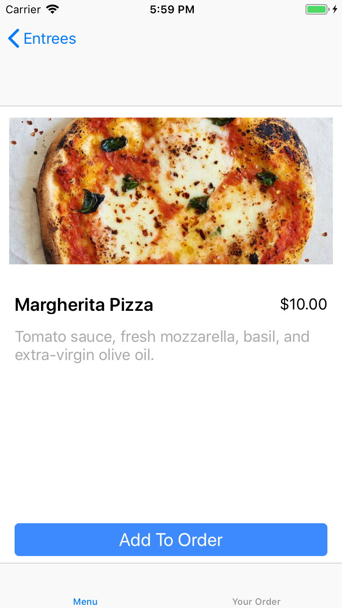

# Restaurant - Native App Studio Unit 5
Vincent K - 11011041

## Description

This app was made for the University of Amsterdam course Native App Studio (5062NAAS6Y). The app is a sample restaurant app in which the user can browse through a menu that is loaded through the Native App Studio Resto API. The user can add items to their order and order them. When the user orders, the list of items is sent back to the Resto server.

## Screenshot

